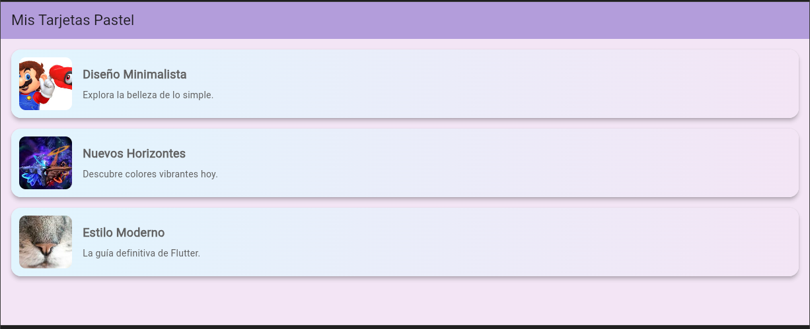

# myapp

# Mi Prompt

Lenguaje Dart Flutter, nivel principiante. En una columna insertar 3 filas y en cada fila una tarjeta (card), en cada tarjeta (una imagen desde la red, a la derecha una columna con 2 filas, en la primera fila un título, en la segunda fila un subtítulo, los textos alineados a la izquierda), la tarjeta con sombreado, utiliza colores atractivos estilo pastel, intenta usar azul y morado. Crear la clase producto con los atributos "Título", "Subtítulo" e "Img url".  Crear una lista de diccionarios por cada tarjeta. Proporciona el código correspondiente en un solo archivo.

## Mi diseño

